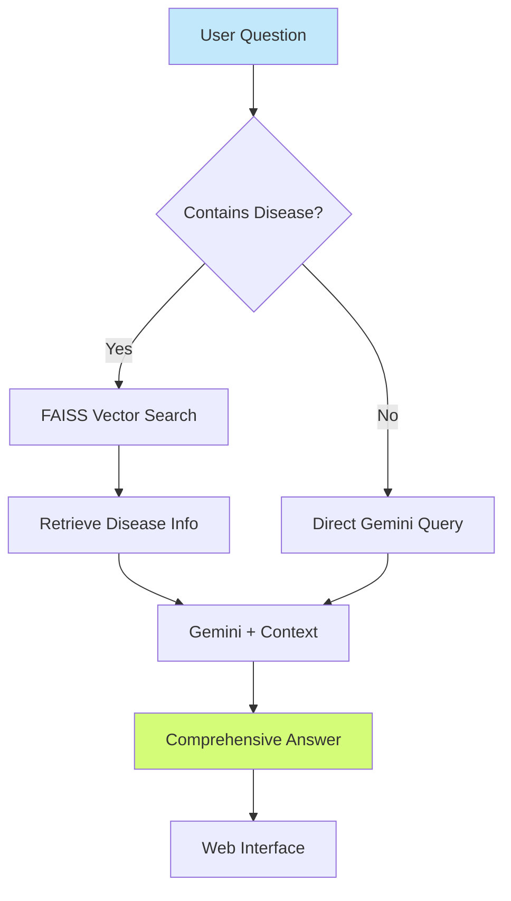

# 🩺 Medical Assistant RAG Chatbot

<div align="center">


**Intelligent medical chatbot powered by RAG (Retrieval-Augmented Generation) for disease information and symptom analysis**

[Features](#-features) • [Installation](#-installation) • [Usage](#-usage) • [Architecture](#-architecture) • [Dataset](#-dataset)

</div>

---

## 📖 Overview

Medical Assistant is an advanced AI-powered chatbot that combines **RAG (Retrieval-Augmented Generation)** with medical knowledge to provide accurate, detailed information about diseases, symptoms, treatments, and medical conditions. Built with FAISS vector search and Google's Gemini AI, it intelligently retrieves relevant medical information from a curated dataset and generates comprehensive, professional responses.

### 🎯 What Makes It Special?

- **Hybrid RAG System**: Combines dataset retrieval with Gemini's vast medical knowledge
- **Smart Disease Detection**: Automatically identifies mentioned diseases
- **Vector-Based Search**: FAISS for fast semantic similarity matching
- **Comprehensive Answers**: Covers symptoms, causes, complications, and treatments
- **Professional Medical Language**: Clear, accurate, and detailed responses
- **Beautiful Web Interface**: Clean, medical-themed UI
- **Input Validation**: Filters non-medical queries

---

## ✨ Features

### 🧠 **Intelligent RAG Pipeline**

#### Dual-Mode Operation:

**1️⃣ Dataset Mode (Disease Found)**
- Searches medical knowledge base
- Uses FAISS vector similarity
- Retrieves exact disease information
- Gemini generates detailed response from context

**2️⃣ General Mode (Disease Not Found)**
- Falls back to Gemini's general knowledge
- Answers broader medical questions
- Maintains professional medical standards
- Provides comprehensive explanations

### 📚 **Medical Knowledge Base**
- **CSV-Based Dataset**: `disease_description.csv`
- **Disease Coverage**: Multiple diseases with detailed descriptions
- **Symptom Descriptions**: Comprehensive symptom information
- **Searchable Index**: FAISS L2 distance similarity
- **Automatic Preprocessing**: Cleans and normalizes data

### 💬 **Comprehensive Responses**
- ✅ **Symptoms**: Detailed symptom descriptions
- ✅ **Causes**: Root causes and risk factors
- ✅ **Complications**: Potential complications
- ✅ **Treatments**: Recommended treatment options
- ✅ **Diagnosis**: How conditions are diagnosed
- ✅ **Medical Facts**: Additional important information

### 🎨 **User Interface**
- **Medical Theme**: Green gradient design
- **Responsive Layout**: Works on all devices
- **Clean UX**: Simple question/answer format
- **Professional Styling**: Medical-grade appearance
- **Real-time Responses**: Instant answer generation

### 🔒 **Input Validation**
- Filters non-medical questions
- Minimum query length requirement
- Professional error messages
- Medical context enforcement

---

## 🏗️ Architecture

### RAG Workflow



### System Architecture

```
┌──────────────────────────────────────────────┐
│           Flask Web Application              │
├──────────────────────────────────────────────┤
│                                              │
│  ┌────────────────────────────────────────┐ │
│  │        Medical RAG Pipeline            │ │
│  ├────────────────────────────────────────┤ │
│  │                                        │ │
│  │  1. Question Analysis                 │ │
│  │     ↓                                  │ │
│  │  2. Disease Detection                 │ │
│  │     ↓                                  │ │
│  │  ┌─────────────┬─────────────┐        │ │
│  │  │ Dataset     │ General     │        │ │
│  │  │ Mode        │ Mode        │        │ │
│  │  └─────────────┴─────────────┘        │ │
│  │     ↓                ↓                 │ │
│  │  3. FAISS Search  Direct Query        │ │
│  │     ↓                ↓                 │ │
│  │  4. Context Retrieval                 │ │
│  │     ↓                                  │ │
│  │  5. Gemini Generation                 │ │
│  │     ↓                                  │ │
│  │  6. Medical Response                  │ │
│  │                                        │ │
│  └────────────────────────────────────────┘ │
│                                              │
│  ┌────────────────────────────────────────┐ │
│  │     FAISS Vector Database              │ │
│  │  (In-Memory L2 Index)                  │ │
│  └────────────────────────────────────────┘ │
│                                              │
│  ┌────────────────────────────────────────┐ │
│  │  Medical Knowledge Base                │ │
│  │  (disease_description.csv)             │ │
│  └────────────────────────────────────────┘ │
│                                              │
└──────────────────────────────────────────────┘
              ▲
              │
    ┌─────────┴─────────┐
    │  Gemini 2.0 API   │
    └───────────────────┘
```

### Tech Stack

| Component | Technology | Purpose |
|-----------|-----------|---------|
| **Backend** | Flask 3.0 | Web server |
| **AI Model** | Google Gemini 2.0 Flash | Answer generation |
| **Vector DB** | FAISS (L2 Index) | Semantic search |
| **Embeddings** | SentenceTransformers | Text vectorization |
| **Model** | all-MiniLM-L6-v2 | Embedding model |
| **Data Processing** | Pandas | CSV handling |
| **Frontend** | HTML/CSS/Jinja2 | Web interface |
| **Domain** | Medical/Healthcare | Disease information |

---

## 🚀 Installation

### Prerequisites

- Python 3.8 or higher
- Google Gemini API Key ([Get it here](https://makersuite.google.com/app/apikey))
- Medical dataset CSV file

### Step 1: Clone the Repository

```bash
git clone https://github.com/janaelpardisi/medical-rag-chatbot.git
cd medical-rag-chatbot
```

### Step 2: Create Virtual Environment

```bash
python -m venv venv

# On Windows
venv\Scripts\activate

# On macOS/Linux
source venv/bin/activate
```

### Step 3: Install Dependencies

```bash
pip install -r requirements.txt
```

### Step 4: Configure Environment

Create a `.env` file in the project root:

```env
GEMINI_API_KEY=your_gemini_api_key_here
```

⚠️ **Important**: Never commit your `.env` file!

Add to `.gitignore`:

```
.env
__pycache__/
*.pyc
venv/
.vscode/
*.log
disease_description.csv
```

### Step 5: Prepare Dataset

Place your `disease_description.csv` file in the project directory.

**Required CSV format:**

```csv
Disease,Symptom_Description
diabetes,"High blood sugar, frequent urination, increased thirst..."
hypertension,"High blood pressure, headaches, dizziness..."
asthma,"Difficulty breathing, wheezing, chest tightness..."
```

**Update path in `main.py`:**

```python
df = pd.read_csv("disease_description.csv")
# Or use absolute path:
# df = pd.read_csv(r"C:\path\to\disease_description.csv")
```

---

## 💻 Usage

### Running the Web Application

```bash
python app.py
```

The application will start at `http://127.0.0.1:5500`

**How to use:**
1. Open browser: `http://localhost:5500`
2. Enter your medical question
3. Click "Ask"
4. Get comprehensive medical information

### Example Questions

```
✅ "What are the symptoms of diabetes?"
✅ "Tell me about hypertension causes and treatment"
✅ "What is asthma and how is it diagnosed?"
✅ "What are the complications of pneumonia?"
✅ "How to treat migraine headaches?"
```

### Non-Medical Queries (Rejected)

```
❌ "What's the weather today?"
❌ "How to cook pasta?"
❌ "Tell me a joke"
```

### Using the CLI Version (Optional)

Uncomment the code in `main.py`:

```python
print("🩺 Welcome to the Medical Assistant Chatbot! Type 'exit' to quit.")
while True:
    user_input = input("You: ")
    if user_input.strip().lower() == "exit":
        break
    response = ask_disease_bot(user_input)
    print("🤖:", response, "\n")
```

Then run:

```bash
python main.py
```

---

## 📁 Project Structure

```
medical-rag-chatbot/
│
├── main.py                      # Core RAG logic & FAISS setup
├── app.py                       # Flask web application
├── requirements.txt             # Python dependencies
├── .env                         # Environment variables (not in repo)
├── .gitignore                  # Git ignore file
├── README.md                   # This file
│
├── templates/
│   └── index.html              # Medical chatbot UI
│
└── disease_description.csv     # Medical knowledge dataset
```

---

## 🔧 Configuration

### Adjusting Dataset Path

In `main.py`:

```python
# Relative path
df = pd.read_csv("disease_description.csv")

# Absolute path (Windows)
df = pd.read_csv(r"C:\Users\YourName\medical-chatbot\disease_description.csv")

# Absolute path (macOS/Linux)
df = pd.read_csv("/home/username/medical-chatbot/disease_description.csv")
```

### Changing Embedding Model

```python
# Current: Lightweight, fast
embedder = SentenceTransformer("all-MiniLM-L6-v2")

# Alternative: Better accuracy, slower
embedder = SentenceTransformer("all-mpnet-base-v2")

# Alternative: Multilingual support
embedder = SentenceTransformer("paraphrase-multilingual-MiniLM-L12-v2")
```

### Modifying Search Parameters

```python
# Retrieve top-k documents
D, I = index.search(q_embedding, k=3)  # Change k for more results

# Use different FAISS index
index = faiss.IndexFlatIP(dim)  # Inner product instead of L2
```

### Customizing Prompt

Edit the prompt in `main.py`:

```python
prompt = f"""
You are a professional medical assistant.
[Your custom instructions here]

Context: {context}
Question: {question}
"""
```

### Changing Server Port

In `app.py`:

```python
if __name__ == "__main__":
    app.run(debug=True, port=8080)  # Change port
```

---

## 🔄 How It Works

### Processing Flow

1. **User Input**
   - User submits medical question
   - Question normalized (lowercase, stripped)

2. **Query Validation**
   - Check minimum length (3+ words)
   - Reject non-medical queries

3. **Disease Detection**
   - Check if any disease name mentioned
   - Match against dataset disease list

4. **RAG Decision**
   - **If disease found**: Use dataset mode
   - **If not found**: Use general mode

5. **Dataset Mode (RAG)**
   - Convert question to embedding
   - FAISS searches for most similar disease
   - Retrieve disease description
   - Gemini generates answer with context

6. **General Mode**
   - Gemini answers using general knowledge
   - Follows strict medical guidelines
   - Validates question is medical

7. **Response Generation**
   - Comprehensive answer created
   - Covers all medical aspects
   - Displayed on web interface

### Example Flow (Dataset Mode)

```
Question: "What are the symptoms of diabetes?"

1. Normalize: "what are the symptoms of diabetes?"

2. Detect: "diabetes" found in dataset ✓

3. Embedding: [0.23, -0.45, 0.67, ...] (384 dimensions)

4. FAISS Search:
   - Top match: "diabetes" chunk
   - L2 Distance: 0.02 (very similar)

5. Context:
   "Disease: diabetes
   Symptoms: High blood sugar, frequent urination..."

6. Gemini Prompt:
   "Based on: [context]
   Answer: What are the symptoms of diabetes?"

7. Response:
   "Diabetes presents with several key symptoms:
   - Frequent urination (polyuria)
   - Increased thirst (polydipsia)
   - High blood sugar levels
   ..."
```

---

## 🐛 Troubleshooting

### Common Issues

**Issue**: `ModuleNotFoundError: No module named 'faiss'`

**Solution**:
```bash
pip install faiss-cpu
# OR for GPU:
pip install faiss-gpu
```

---

**Issue**: `FileNotFoundError: disease_description.csv`

**Solution**:
```python
# Use absolute path in main.py
df = pd.read_csv(r"C:\full\path\to\disease_description.csv")
```

---

**Issue**: `GEMINI_API_KEY not found`

**Solution**:
- Create `.env` file in project root
- Add: `GEMINI_API_KEY=your_key_here`
- Restart the application

---

**Issue**: CSV encoding errors

**Solution**:
```python
df = pd.read_csv("disease_description.csv", encoding='utf-8-sig')
```

---

**Issue**: Slow embedding generation

**Solution**:
```python
# Use smaller model
embedder = SentenceTransformer("all-MiniLM-L6-v2")

# Or enable GPU (if available)
embedder = SentenceTransformer("all-MiniLM-L6-v2", device='cuda')
```

---

**Issue**: Non-medical queries accepted

**Solution**:
```python
# Increase minimum word requirement
if len(q_lower.split()) < 5:  # Stricter validation
```

---

## 📊 Performance

### Benchmarks

- **CSV Loading**: ~100ms for 100 diseases
- **Embedding Generation**: ~50ms per query
- **FAISS Search**: <5ms for 1000 vectors
- **Gemini Response**: 1-3 seconds
- **Total Response Time**: ~2-4 seconds

### Scalability

- **Dataset Size**: Handles 10,000+ diseases
- **FAISS Index**: Millions of vectors supported
- **Concurrent Users**: Flask async support
- **Memory Usage**: ~200MB with 1000 diseases

---

## 🎨 Customizing the UI

### Changing Colors (Medical Theme)

Edit CSS in `templates/index.html`:

```css
/* Gradient background */
background: linear-gradient(135deg, #c2e9fb, #d4fc79);

/* Primary color (header, buttons) */
color: #00796b;

/* Hover state */
background-color: #004d40;

/* Response box */
background-color: #e0f7fa;
border-left: 5px solid #00796b;
```

### Adding Logo

```html
<h2>
    
    🩺 Medical Assistant Chatbot
</h2>
```

### Responsive Design Enhancement

```css
@media (max-width: 768px) {
    .container {
        padding: 15px;
        margin: 10px;
    }
}
```

---

## 🤝 Contributing

Contributions are welcome! Here's how:

1. **Fork** the repository
2. **Create** a feature branch (`git checkout -b feature/NewFeature`)
3. **Commit** your changes (`git commit -m 'Add NewFeature'`)
4. **Push** to the branch (`git push origin feature/NewFeature`)
5. **Open** a Pull Request

### Ideas for Contribution

- [ ] Add more diseases to dataset
- [ ] Implement conversation history
- [ ] Add symptom checker feature
- [ ] Multi-language support
- [ ] Voice input/output
- [ ] Export answers to PDF
- [ ] Add medical images
- [ ] Implement user feedback system
- [ ] Add citation sources
- [ ] Create mobile app

---

## 📝 License

This project is licensed under the MIT License.

```
MIT License

Copyright (c) 2024 Jana Ashraf

Permission is hereby granted, free of charge, to any person obtaining a copy
of this software and associated documentation files (the "Software"), to deal
in the Software without restriction...
```

---

## ⚠️ Medical Disclaimer

**IMPORTANT**: This chatbot is for **informational purposes only** and should NOT be used as a substitute for professional medical advice, diagnosis, or treatment. 

- Always consult a qualified healthcare provider for medical concerns
- Do not delay seeking medical attention based on chatbot responses
- In case of emergency, call your local emergency services
- The information provided may not be complete or up-to-date

---

## 👨‍💻 Author

**Jana Ashraf**
- GitHub: [@janaelpardisi](https://github.com/janaelpardisi)
- LinkedIn: [Jana Ashraf](https://www.linkedin.com/in/jana-ashraf-elpardisi)

---

## 🙏 Acknowledgments

- [FAISS](https://github.com/facebookresearch/faiss) - For vector search
- [Sentence Transformers](https://www.sbert.net/) - For embeddings
- [Google Gemini](https://deepmind.google/technologies/gemini/) - For LLM
- [Flask](https://flask.palletsprojects.com/) - For web framework
- Medical community for knowledge sharing

---

## 📈 Roadmap

**Current Version**: v1.0

**Upcoming Features**:
- [ ] Symptom checker with decision tree
- [ ] Multi-turn conversation support
- [ ] PDF/medical document upload
- [ ] Integration with medical APIs
- [ ] Doctor finder feature
- [ ] Medication information database
- [ ] Appointment booking system
- [ ] Health tracking dashboard
- [ ] Mobile app (iOS/Android)
- [ ] Voice assistant integration

---

## 💡 Use Cases

### Healthcare Providers
- Quick disease reference
- Patient education materials
- Symptom documentation
- Treatment guidelines

### Medical Students
- Study companion
- Disease information lookup
- Exam preparation
- Quick reference tool

### General Public
- Health awareness
- Symptom understanding
- Disease prevention info
- When to see a doctor guidance

### Researchers
- Disease classification
- Symptom analysis
- Medical knowledge extraction
- Data annotation

---

<div align="center">

**Made with Jana Ashraf ❤️**

**⚕️ Empowering Health Through AI**

[⬆ Back to Top](#-medical-assistant-rag-chatbot)

</div>
